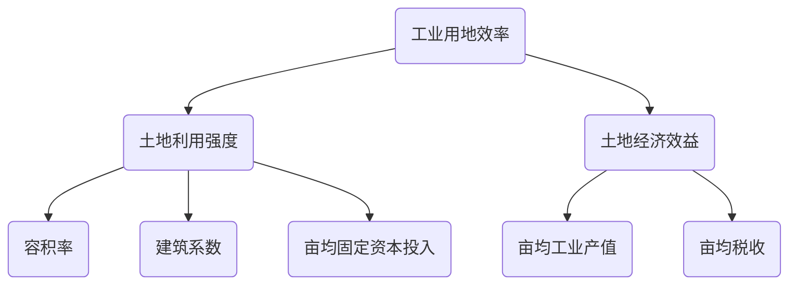
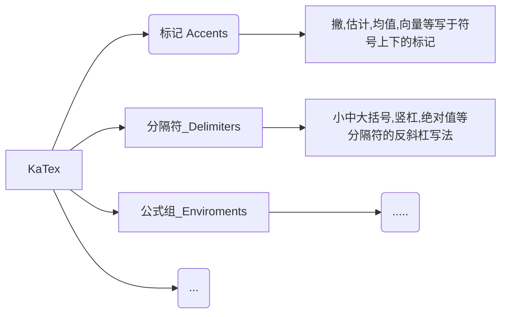

$$
\mathbf{V}_1 \times \mathbf{V}_2 =  \begin{vmatrix} 
\mathbf{i} & \mathbf{j} & \mathbf{k} \\
\frac{\partial X}{\partial u} &  \frac{\partial Y}{\partial u} & 0 \\
\frac{\partial X}{\partial v} &  \frac{\partial Y}{\partial v} & 0 \\
\end{vmatrix}
${$tep1}{\style{visibility:hidden}{(x+1)(x+1)}}
$$
使用 <kbd>Ctrl</kbd>+<kbd>Alt</kbd>+<kbd>Del</kbd> 重启==电脑==

- [x] 代办
- [ ] 代办


```flow

st=>start: Start
e=>end: End
接收用户名和密码=>operation: 接收用户名和密码
使用用户名查询数据库=>operation: 使用用户名查询数据库
数据库中是否有数据=>condition: 数据库中是否有数据?
走登录逻辑=>operation: 走登录逻辑
走注册逻辑=>operation: 走注册逻辑
密码是否正确=>condition: 密码是否正确?
把用户名和密码写入数据库=>inputoutput: 把用户名和密码写入数据库 

st->接收用户名和密码->使用用户名查询数据库->数据库中是否有数据
数据库中是否有数据(yes)->走登录逻辑->密码是否正确
数据库中是否有数据(no)->走注册逻辑->把用户名和密码写入数据库->e
密码是否正确(yes)->e
密码是否正确(no,down)->接收用户名和密码
```




